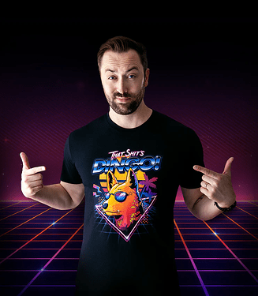

# TaysVLDLPack

Viva La Dirt League Clothing Pack For ALTV, FiveM and Single Player

# Screenshots 📸

| | |
|-|-|
|  |  |


----------------------------------------------------------------

# **FEATURES:** 🌟

## MALE SHIRTS

```tay
VLDL 'That Shit's Dingo' Tank Top

VLDL 'That Shit's Dingo' V Neck T-Shirt

VLDL 'That Shit's Dingo' Crew Neck (Long)

VLDL 'That Shit's Dingo' Crew Neck

VLDL 'That Shit's Dingo' Long Sleeve Ringer Jersey

VLDL 'That Shit's Dingo' Long Sleeve V Neck
```


## MALE HOODIES

**Hood Down**

```tay

VLDL 'That Shit's Dingo' Black Hoodie
```

**Hood Up**

```tay
VLDL 'That Shit's Dingo' Black Hoodie
```

---------------------------------------

## FEMALE SHIRTS

```tay
VLDL 'That Shit's Dingo' Casual Off Shoulder Top Short Sleeve T-Shirt

- VLDL 'That Shit's Dingo' Crew Neck

- VLDL 'That Shit's Dingo' Crew Long Sleeve Jersey
```

## FEMALE HOODIES

**Hood Down**

```tay
VLDL 'That Shit's Dingo' Black Hoodie
```

**Hood Up**

```tay
VLDL 'That Shit's Dingo' Black Hoodie
```


----------------------------------------

# INSTALLATION INSTRUCTIONS:

## Single Player

- Copy the taysvldlpack folder found within the FILES > SINGLE PLAYER folder with the dlc.rpf file to this sub folder of your mods folder: mods/update/x64/dlcpacks (Create it if its not there)

- In order to make the game load this new dlc.rpf file, we need to modify the games dlclist.xml, this can be done by searching for dlclist.xml using OpenIV and copying it to your mods folder: mods/update/update.rpf/common/data (Create it if its not there)

- Open the dlclist.xml and add the following:

dlcpacks:/taysvldlpack/

To apply the new clothes you will need some mod menu, suggested ones are:
Menyoo: [https://github.com/MAFINS/MenyooSP/releases](https://gta5-mods.com/scripts/menyoo-pc-sp)

--------------------------------------

## ALTV

Open the FILES folder, go to ALTV and add taysvldlpack to your server.cfg as a separate line below resources and before the enclosing. Your server.cfg resources configuration could look similar to this:

resources: [
altv-better-clothing,
taysvldlpack
]
Start your server and connect to it

--------------------------------------

## FiveM

- Download vMenu and put it in your server/resources folder [vMenu]( https://github.com/TomGrobbe/vMenu/releases)

- Open the FILES folder and drag the taysvldlpack inside the FIVEM folder, into your FiveM resources

- Add ensure taysvldlpack to your server.cfg

- Press M to open vMenu and browse thru your new added clothes (They are always added to the end / last DLC clothes)

IF THEY DO NOT APPEAR, YOU DO NOT HAVE THE REQUIRED PATREON SUBSCRIPTION TO STREAM CLOTHING.

# License 📝

This repository was created by **TayMcKenzieNZ** for strict usage with the Grand Theft Auto 5 single player and unofficial multiplayer platforms, and is under the GNU General Public License v3.0 license.

 ' That Shit's Dingo ' artwork is the intellectual property of Angga Tantama and was comissioned by Viva La Dirt League.

## All rights are reserved and no copyright infringement was intended.


---------------------------------------

# Say Thanks ☕:

[BuyMeACoffee](https://www.buymeacoffee.com/taymckenzienz)
